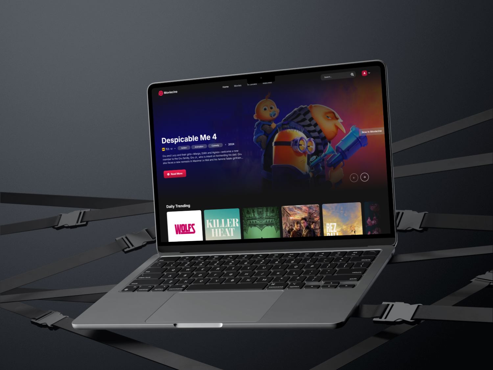

<h1 align="center" style="font-size: 50px">Moviecine</h1>

 

> # [Live Demo](https://moviecine-app.vercel.app/)  

 

## Introduction

Moviecine is a responsive and modern web application designed for reviewing movies and TV shows, similar to platforms like IMDb. This project was developed using cutting-edge technologies such as Next.js, TypeScript, and Appwrite to create a comprehensive platform for film enthusiasts.

Some of the key functionalities of Moviecine include:

- Adding movies and TV shows to a personalized watchlist
- Writing and posting reviews for movies and series
- User authentication and profile management
  
Thanks to the integration with the TMDB API, Moviecine provides up-to-date information about movies and shows. Users can optimize their experience through server-side rendering (SSR) and custom Next.js API routes for smooth data management.

The backend for the application is deployed on Appwrite, ensuring secure user data handling and seamless interaction between frontend and backend.

Tech Stack:

<ul>
  <li>Next.js</li>
  <li>Appwrite</li>
  <li>Typescript</li>
  <li>TailwindCSS</li>
  <li>ShadCN</li>
  <li>ZOD</li>
  <li>React Hook Form</li>
</ul>

 

## Mockup

 

